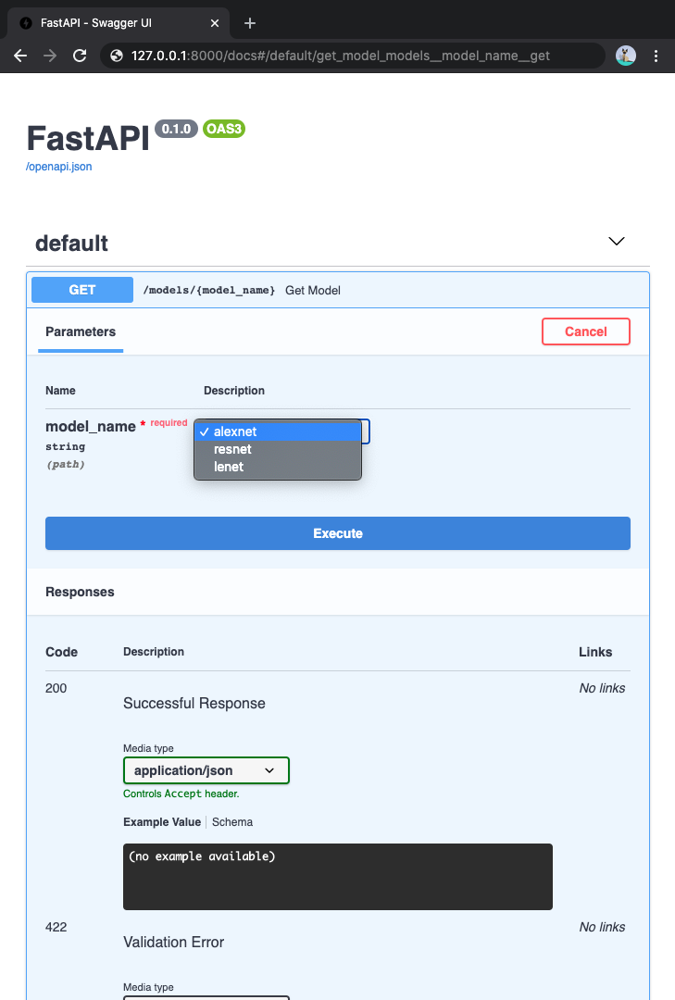

# Path Parameters
- https://fastapi.tiangolo.com/tutorial/path-params/

경로 "매개 변수"또는 "변수"를 파이썬 형식 문자열에서 사용하는 것과 동일한 구문으로 선언 할 수 있습니다.

```python
from fastapi import FastAPI

app = FastAPI()

@app.get("/items/{item_id}")
async def read_item(item_id):
    return {"item_id": item_id}
```

경로 매개 변수 `item_id`의 값은 인수 `item_id`로 함수로 전달됩니다.

따라서 이 예제를 실행하고 http://127.0.0.1:8000/items/foo로 이동하면 다음과 같은 응답이 표시됩니다.

```text
{"item_id":"foo"}
```

## 유형이있는 경로 매개 변수

표준 파이썬 유형을 사용하여 함수의 경로 매개 변수의 유형을 선언 할 수 있습니다.

```python
async def read_item(item_id: int):
    pass
```

이 경우 `item_id`는 `int`로 선언됩니다.

### 체크
이렇게하면 오류 검사, 완료 등과 함께 기능 내부에 편집기 지원이 제공됩니다.

## 데이터 변환

이 예제를 실행하고 http://127.0.0.1:8000/Items/3에서 브라우저를 열면 다음과 같은 응답이 표시됩니다.
```text
{"item_id":3}
```

### 체크

수신 (및 반환 된) 함수 값은 파이썬 `int`로서 `string` `"3"`이 아닙니다.

따라서 해당 유형 선언으로 FastAPI는 자동 요청 "구문 분석"을 제공합니다.

## 데이터 유효성 검사

그러나 http://127.0.0.1:8000/items/foo에서 브라우저에 가면 좋은 HTTP 오류가 표시됩니다.
```json
{
    "detail": [
        {
            "loc": [
                "path",
                "item_id"
            ],
            "msg": "value is not a valid integer",
            "type": "type_error.integer"
        }
    ]
}
```
경로 매개 변수 `item_id`는 `int`가 아닌 "foo" 값이 있기 때문입니다.

`int` 대신 `float`를 제공 한 경우 동일한 오류가 나타납니다. http://127.0.0.1:8000/Items/4.2

### 체크

따라서 동일한 파이썬 유형 선언을 사용하면 **FastAPI**가 데이터 유효성 검사를 제공합니다.

이 오류는 또한 유효성 검사가 통과하지 않은 지점을 정확히 나타냅니다.

이는 API와 상호 작용하는 코드를 개발하고 디버깅하는 동안 매우 유용합니다.

## 문서

http://127.0.0.1:8000/docs에서 브라우저를 열면 다음과 같은 자동 대화 형 API 문서가 표시됩니다.


### 체크

다시 말하지만, 동일한 Python 유형 선언으로 **FastAPI**는 자동 대화 형 문서 (Swagger UI 통합)를 제공합니다. 

경로 매개 변수는 정수로 선언됩니다.

## 표준 기반 혜택, 대체 문서

생성 된 스키마가 [OpenAPI](https://github.com/OAI/OpenAPI-Specification/blob/main/versions/3.0.2.md) 표준에서 발생하기 때문에 많은 호환 가능한 도구가 있습니다.

이 때문에 **FastAPI** 자체는 http://127.0.0.1:8000/Redoc에서 액세스 할 수 있는 대체 API 문서(Redoc사용)를 제공합니다.


같은 방식으로 호환되는 도구가 많이 있습니다. 다양한 언어에 대한 코드 생성 도구 포함.

## Pydantic

모든 데이터 유효성 검사는 [Pydantic](https://pydantic-docs.helpmanual.io/)에 의해 내부적으로 수행되므로 모든 이점을 얻을 수 있습니다. 

그리고 당신은 좋은 손에 있다는 것을 압니다.

`str`, `float`, `bool` 및 기타 여러 복잡한 데이터 형식과 동일한 형식 선언을 사용할 수 있습니다.

이 중 몇 가지가 튜토리얼의 다음 장에서 탐색됩니다.

## 순서 문제

경로 작업을 생성할 때 고정된 경로가 있는 상황을 찾을 수 있습니다.

`/users/me`와 같이, 그것은 현재 사용자에 대한 데이터를 얻기 위한 것이라고 가정해 보자.

그런 다음 일부 사용자 ID에서 특정 사용자에 대한 데이터를 가져오는 `/users/{user_id}` 경로를 가질 수도 있습니다.

경로 작업은 순서대로 평가되므로 /users/me에 대한 경로가 /users/{user_id}에 대한 경로보다 먼저 선언되었는지 확인해야 합니다.

```python
from fastapi import FastAPI

app = FastAPI()

@app.get("/users/me")
async def read_user_me():
    return {"user_id": "the current user"}


@app.get("/users/{user_id}")
async def read_user(user_id: str):
    return {"user_id": user_id}
```

그렇지 않으면 `/users/{user_id}`에 대한 경로도 `/users/me`와 일치하며 `"me"` 값을 가진 user_id 매개 변수를 받는다고 "생각"합니다.

## 미리 정의된 값

만약 당신이 당신이 가능한 유효한 경로 매개 변수 값을 미리 정의될 수 있으려면 길을 매개 변수를 받는 경로 작업도 있고, 표준 파이썬 `Enum`을 사용할 수 있다.

### Enum 클래스 생성

`Enum`을 가져오고 `Enum`에서 `str`을 상속하는 하위 클래스를 만듭니다.

`str`에서 상속함으로써 API 문서는 값이 문자열 유형이어야 하며 올바르게 렌더링될 수 있음을 알 수 있습니다.

그런 다음 사용 가능한 유효한 값이 될 고정 값으로 클래스 속성을 만듭니다.

````python
from enum import Enum
from fastapi import FastAPI


class ModelName(str, Enum):
    alexnet = "alexnet"
    resnet = "resnet"
    lenet = "lenet"

app = FastAPI()


@app.get("/models/{model_name}")
async def get_model(model_name: ModelName):
    if model_name == ModelName.alexnet:
        return {"model_name": model_name, "message": "Deep Learning FTW!"}

    if model_name.value == "lenet":
        return {"model_name": model_name, "message": "LeCNN all the images"}

    return {"model_name": model_name, "message": "Have some residuals"}
````

#### 정보

Enumerations (또는 enums) Python 버전 3.4부터 이용할 수 있다.

#### 팁

"AlexNet", "ResNet", "LeNet" 단어는 머신 러닝 모델의 이름일 뿐입니다.

### 경로 매개 변수 선언

그런 다음 작성한 enum 클래스 (modelName)를 사용하여 형식 주석이있는 경로 매개 변수를 만듭니다.

````python
@app.get("/models/{model_name}")
async def get_model(model_name: ModelName):
    pass
````

### 문서 확인

경로 매개 변수에 대한 사용 가능한 값이 미리 정의되기 때문에 대화식 문서가 멋지게 표시 할 수 있습니다.



### Python 열거 작업

경로 매개 변수의 값은 열거형 멤버입니다.

#### 열거형 멤버 비교

생성 된 enum `ModelName`의 열거 형 멤버와 비교할 수 있습니다.

````python
@app.get("/models/{model_name}")
async def get_model(model_name: ModelName):
    if model_name == ModelName.alexnet:
        return {"model_name": model_name, "message": "Deep Learning FTW!"}
    ...
````

#### 열거값을 가져옵니다.

`model_name.value` 또는 일반적으로 `your_enum_member.value`를 사용하여 실제 값을 가져올 수 있습니다.

```python
@app.get("/models/{model_name}")
async def get_model(model_name: ModelName):
    if model_name.value == "lenet":
        return {"model_name": model_name, "message": "LeCNN all the images"}

    ...
```

`ModelName.lenet.value`와 함께 `"lenet"` 값에 액세스 할 수도 있습니다.

#### 열거 멤버 반환

경로 작업에서 열거 멤버를 반환할 수 있으며 JSON 본문(예: `dict`)에 중첩될 수도 있습니다.

이러한 값은 클라이언트에 반환하기 전에 해당 값(이 경우 문자열)으로 변환됩니다.

```python
@app.get("/models/{model_name}")
async def get_model(model_name: ModelName):
    if model_name == ModelName.alexnet:
        return {"model_name": model_name, "message": "Deep Learning FTW!"}

    if model_name.value == "lenet":
        return {"model_name": model_name, "message": "LeCNN all the images"}

    return {"model_name": model_name, "message": "Have some residuals"}
```

고객에게 다음과 같이 JSON 응답을 받게됩니다.

```json
{
  "model_name": "alexnet",
  "message": "Deep Learning FTW!"
}
```

## 경로를 포함하는 경로 매개 변수
경로 작업이 `/files/{file_path}`인 경우를 가정해 보겠습니다.

그러나 `file_path` 자체는 `home/johndoe/myfile.txt`과 같은 경로를 포함해야 합니다.

따라서 해당 파일의 URL은 `/files/home/johndoe/myfile.txt`과 같습니다.

### OpenAPI 지원

OpenAPI는 테스트 및 정의가 어려운 시나리오로 이어질 수 있듯이 경로를 포함 할 수있는 경로 매개 변수를 선언하는 방법을 지원하지 않습니다.

그럼에도 불구하고 Starlette의 내부 도구 중 하나를 사용하여 **FastAPI**에서 수행 할 수 있습니다.

매개 변수에 경로가 포함되어야한다고 설명하는 문서를 추가하지는 않지만 문서가 계속 작동합니다.

### 경로 변환기

StarLette에서 직접 옵션 사용하기 URL을 사용하여 경로가 포함 된 Path 매개 변수를 선언 할 수 있습니다.

```text
/files/{file_path:path}
```

이 경우 매개 변수의 이름은 `file_path`이고 마지막 부분 `:path`는 매개 변수가 어떤 경로와 일치해야 한다고 지시합니다.

따라서 다음과 같이 사용할 수 있습니다.

```python
from fastapi import FastAPI

app = FastAPI()


@app.get("/files/{file_path:path}")
async def read_file(file_path: str):
    return {"file_path": file_path}
```

#### 팁

`/home/Johndoe/myfile.txt`을 포함하려면 매개 변수가 필요할 수 있습니다, 선행 슬래시(/)를 사용합니다.

이 경우 URL은 `/files//home/johndoe/myfile.txt` 입니다., `files`과 `home` 사이에 이중 슬래시(//)가 있습니다.

## 요약

**FastAPI**를 사용하면 짧고 직관적이고 표준 파이썬 형식 선언을 사용하여 다음을 수행합니다.

- 편집기 지원 : 오류 점검, 자동 완성 등
- 데이터 "구문 분석"
- 데이터 유효성 검사
- API 주석 및 자동 설명서

그리고 당신은 그들을 한 번 선언해야합니다.

그것은 아마도 다른 프레임 워크(원시 성능 외에도)와 비교하여 **FastAPI**의 주요 장점 일 것입니다.